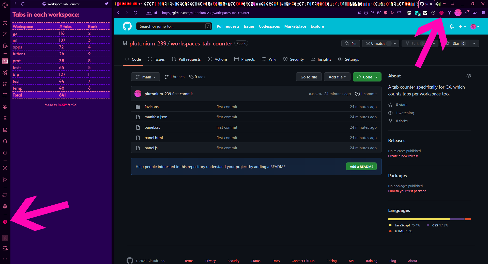
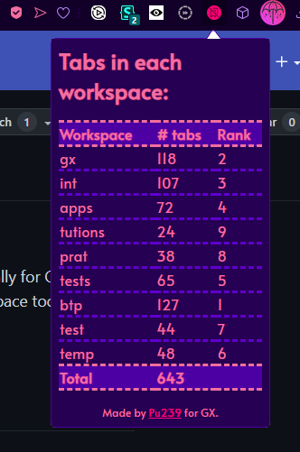
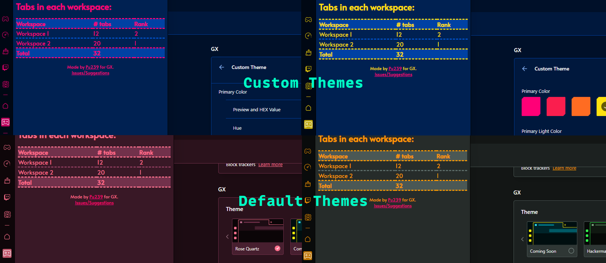

# workspaces-tab-counter

[Get this extension on the opera addons store](https://addons.opera.com/en/extensions/details/workspace-tab-counter/)

This extension adds fine tab counting functionality to Opera GX. It also themes itself according to your GX theme :) (currently only dark)

You can now see how many tabs there are per workspace in a simple table, both as a sidebar panel and an extension popup, wherever you prefer.

***Yes I do have 643 tabs open deal with it.***

Update: Working on adding the current workspace's tab count to the badge, as below:

It does work but sometimes it takes a lot of time to update in the same conditions, so it's not part of the extension yet.
