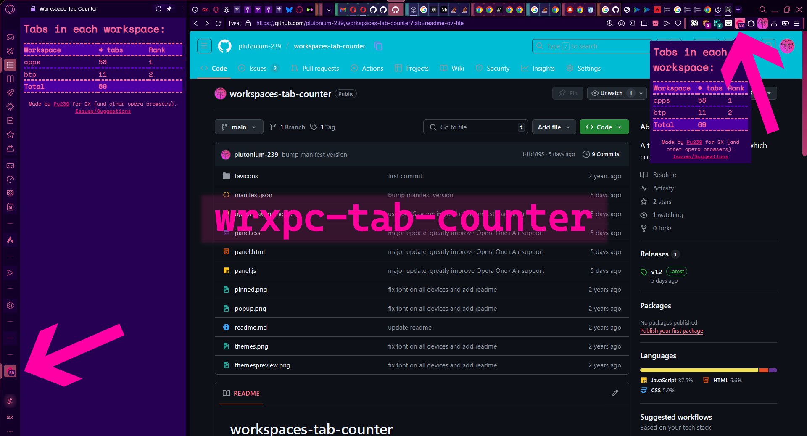

# workspaces-tab-counter

[Get this extension on the opera addons store](https://addons.opera.com/en/extensions/details/workspace-tab-counter/)



> [!IMPORTANT]
> <details>
> <summary>
> If you are using Force Dark Pages, the (border) colors will look a little off. 
> </summary>
> I couldn't find a way to tell GX that the website is already dark. So please add: 
> 
> (if installed from opera addons store)
> ```url
> chrome-extension://jmkkamllgfbbdmpcjahoodclfgehnpla/panel.html
> ```
> 
> (if installed locally)
> ```url
> chrome-extension://lofcdnammfkmkpgphppmojhbpkkcbona/panel.html
> ``` 
>
>  to your "Disable" list on [opera://settings/content/forceDarkMode](opera://settings/content/forceDarkMode)
> </details>


This extension adds fine-grained tab counting functionality to ~~Opera GX~~ ==all Opera browsers== (GX, One, Air). It also themes itself according to your browser theme :)

You can now see how many tabs there are per workspace in a simple table, both as a sidebar panel and an extension popup, wherever you prefer.

> [!NOTE]
> New in version 2.0
> Added a badge on the extension icon on both the popup icon and the sidebar icon displaying the number of tabs in the current workspace. Ofc the badge is also themed according to your browser.
>
> Also, the extension now uses a service worker architecture, which means everything keeps updating **LIVE**! This includes literally everything you can see:
> - Icon Badge (address bar + sidebar)
> - Popup/ Sidebar Panel


## Different places in which the count is displayed

 |  |  |  |
| -----  | ---- | - | - |
| Sidebar Panel | Popup Panel | Sidebar Badge | Popup Badge |


***Yes I do have 643 tabs open deal with it.***\
*Update: \~1050 tabs were lost during the gx old ui -> new ui change \:')* *nooooooo~oooo~ nooooooooo la polizia\~*


